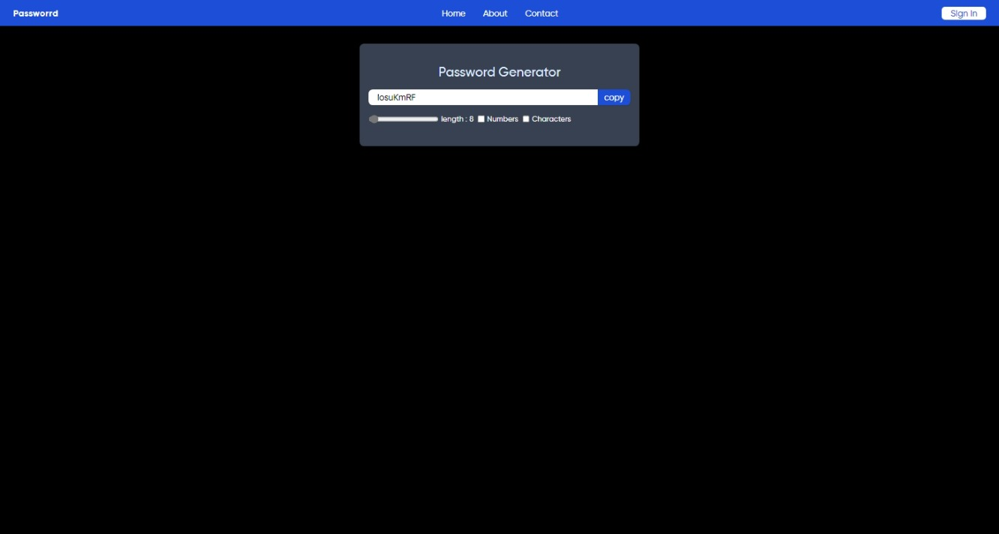
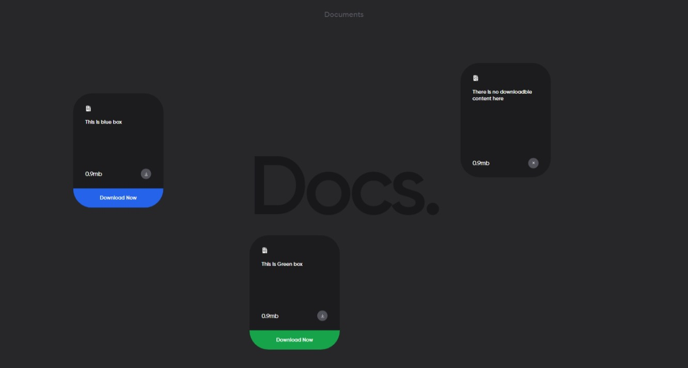

# My React Project Portfolio

Welcome to my project portfolio! Here, I showcase a collection of projects I've developed using various technologies, with a focus on React, Tailwind CSS, and more.

## Table of Contents

- [Projects](#projects)
- [Technologies](#technologies)
- [Contributions](#contributions)
- [Contact](#contact)
- [License](#license)

## Projects

### Project 1: [Password Generator](https://github.com/HAWKSop/mini_react_proj/tree/main/passwordGenerator)

- Description: Brief description of the project.
- Technologies: React, Tailwind CSS, etc.

- Screenshots:

  

### Project 2: [To do list desgin](https://github.com/HAWKSop/mini_react_proj/tree/main/docs)

- Description: Brief description of the project.
- Technologies: React, Tailwind CSS, etc.

- Screenshots:

  

<!-- Add more projects as needed -->

## Technologies

- **React**: Used for building interactive user interfaces.
- **Tailwind CSS**: Applied for styling and design.

## Contributions

Feel free to contribute to any of my projects or provide feedback. Contributions are always welcome! Follow the [contribution guidelines](CONTRIBUTING.md) if available.

## Contact

- Email: ayushranjanbauri1@gmail.com
- LinkedIn: https://www.linkedin.com/in/ayush-ranjan-bauri-94a513228/
- Instagram : https://www.instagram.com/_me_hawks_/

